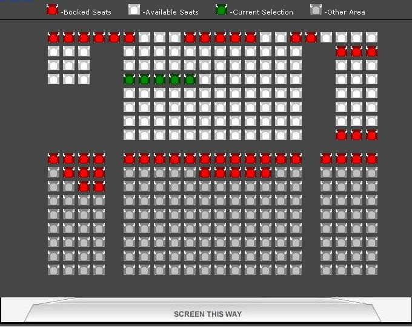

# Movie Tickets

Develop a software-based system for a movie theater. It has several cinemas. Each cinema has its own seat layout. When a customer walks up to buy tickets, a customer service representative asks for the desired movie and time. Given the desired movie and time, the customer chooses the seat(s). Service representative selects the seat(s) in behalf of the customer. Service representative then verifies the chosen seats and show time. After verification, service representative asks for payment and prints the tickets.

- several cinemas (each has own layout)
- movie and time
- seat 
- verification (payment, print tickets)

SERVICE REPRESENTATIVE
- movie screening schedules
- per movie: available seats
- book seats
- one week schedule
- prepare schedule every week

## Stories

As a service representative, I want to see the movie screening schedules, so I can inform the customer and ask for his/her choice.

As a service representative, I want to display the available seats of a given movie screening schedule, so I can let the customer choose seat(s).

As a service representative, I want to book selected seats and print tickets. (Note: Other service representatives are likely to be booking for the same movie seats, on behalf of the customer)

As a system administrator, I want to create optimal movie screening schedules. A movie screening schedule in a theater is designed for a week. In the Philippines, for example, a new movie week starts each Wednesday. Therefore, a movie theater has to prepare a new movie schedule at the beginning of every week. For each week's movie program, management must determine what movies will be shown, on which screens, on which days, and at what times. Typically, on each screen, a theater can accommodate three to five showings per day (3-5 showings per day), where a &ldquo;showing&rdquo; is defined as the screening of one movie, including trailers and advertisements. This means that a 6-screen theater needs to program around 148 showings per week (24 showings a day &times; 7 days a week).

As a system administrator, I want to set-up the seat layout of each cinema. Something like this:

As a user, I want to browse the movie screening schedules, so I can have an idea of show times before I arrive at the movie theater.

As a manager, I want to see reports about ticket sales, so I can determine if the business is profitable or not.

(Constraint) The user must be properly authenticated and authorized before accessing the restricted parts of the system. Only system administrators can manage movie schedules and cinemas. Only service representatives can buy tickets.

## Implementation Requirements

- Must use Spring Web/MVC
- Must use JPA/Hibernate
- Must use Spring Security
- Must use PostgreSQL
- Must include database schema (as a DDL file)
- Must include initial movie schedule data (to ease demonstration)
- Can use Spring Data JPA
- Can use Spring Boot
- Can use Apache Tiles
- Can use Bootstrap (CSS)
